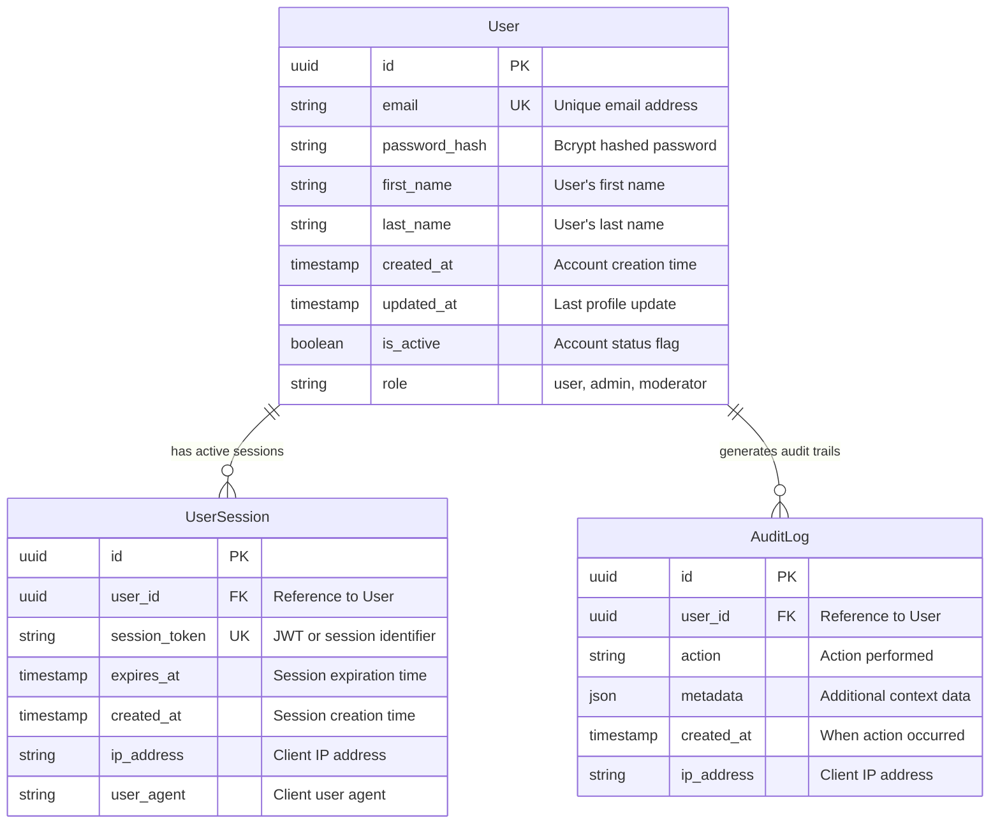
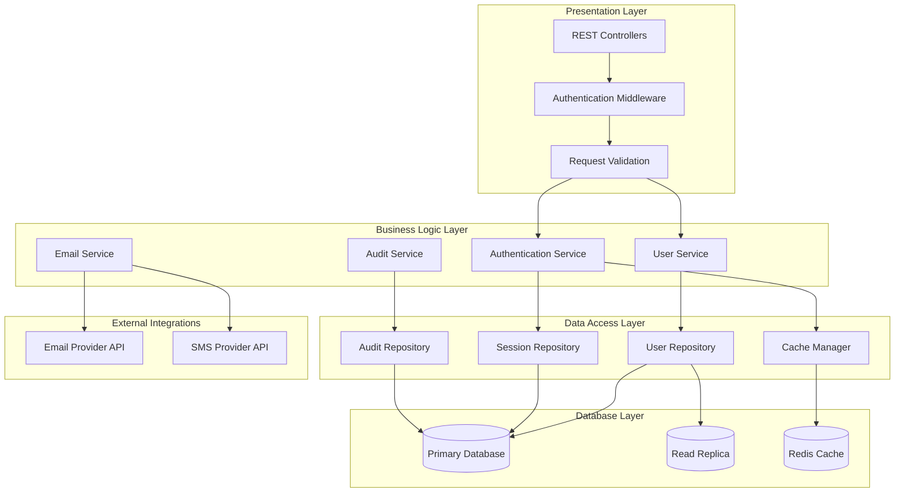
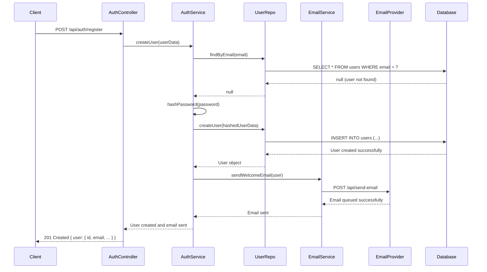
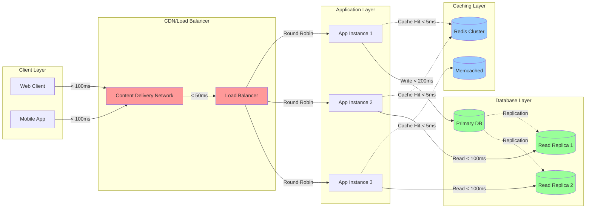

# System Requirements Document (SRD) Creation Workflow

## Overview

System Requirements Documents (SRDs) translate high-level system architecture and Product Requirements Documents (PRDs) into detailed technical specifications for individual systems. Each SRD defines the complete technical requirements for building one system within the overall architecture.

**Position in Spec-Driven Flow**: BRD → PRDs with User Stories → System Architecture (with ADRs) → **SRDs** → Implementation Tasks

## Prerequisites

Before creating SRDs, ensure you have:
- ✅ **Approved System Architecture** (`system-architecture.md`)
- ✅ **Related Architecture Decision Records (ADRs)** for the target system
- ✅ **Product Requirements Documents (PRDs)** with user stories
- ✅ **Technology stack decisions** finalized
- ✅ **Integration patterns** defined between systems

## Process

### Step 1: System Boundary Analysis

1. **Review System Architecture**
   - Identify the specific system being documented
   - Understand system boundaries and responsibilities
   - Review integration points with other systems
   - Understand data flow and communication patterns

2. **Map PRD Requirements to System**
   - Identify which PRD user stories this system must support
   - Extract functional requirements relevant to this system
   - Identify data requirements and business rules
   - Note performance and security requirements

3. **Review Architectural Decisions**
   - Study relevant ADRs that impact this system
   - Understand technology choices and their implications
   - Review architectural patterns and constraints
   - Identify design principles that must be followed

### Step 2: Technical Requirements Analysis

Analyze and document:

- **Functional Capabilities**: What the system must be able to do
- **Data Management**: How data is stored, processed, and accessed
- **Integration Requirements**: How the system communicates with others
- **Performance Requirements**: Speed, throughput, and scalability needs
- **Security Requirements**: Authentication, authorization, and data protection
- **Operational Requirements**: Monitoring, logging, and maintenance needs

### Step 3: SRD Structure (Standardized Template)

Create a comprehensive SRD with these **required sections**:

#### 1. System Overview
- **System Name**: Clear identifier matching system architecture
- **System Purpose**: Primary role and responsibilities within overall architecture
- **System Boundaries**: What is included and excluded from this system
- **Architecture Context**: How this system fits into the overall solution
- **Related Documents**: Links to relevant PRDs, ADRs, and architecture documents

#### 2. Functional Requirements

##### Core System Capabilities
```markdown
## FR-[NN]: [Requirement Title]
**Priority**: High/Medium/Low
**Source**: [PRD reference or business requirement]
**Description**: [Detailed description of what the system must do]

### Acceptance Criteria
- [ ] Specific, testable condition 1
- [ ] Specific, testable condition 2
- [ ] Specific, testable condition 3

### Business Rules
- [Rule 1: Specific business logic that must be enforced]
- [Rule 2: Data validation or processing rules]

### Error Handling
- [Expected error conditions and required responses]
```

##### Data Requirements
- **Data Models**: Entities and their attributes
- **Data Relationships**: How entities relate to each other
- **Data Validation**: Rules for data integrity and quality
- **Data Processing**: Transformation and calculation requirements
- **Data Persistence**: Storage and retrieval requirements

##### System Data Model Diagram (Required)
Include detailed ER diagrams for this system's data entities:



##### System Component Diagram (Required)
Show the internal structure and relationships of system components:



##### Integration Requirements
- **External APIs**: Third-party services and their interfaces
- **Data Exchange**: How data flows between systems
- **Authentication**: Integration security requirements
- **Error Handling**: How integration failures are managed
- **Rate Limiting**: Constraints on external API usage

##### System Integration Sequence Diagrams (Required)
Show detailed interaction flows for external integrations:



#### 3. Non-Functional Requirements

##### Performance Requirements
```markdown
## NFR-P-[NN]: [Performance Requirement]
**Metric**: Response time/Throughput/Concurrent users
**Target**: [Specific measurable target]
**Measurement Method**: [How this will be validated]
**Priority**: Critical/Important/Desired
```

Common performance areas:
- **Response Time**: API endpoint response times under normal load
- **Throughput**: Transactions or requests per second
- **Concurrent Users**: Maximum simultaneous user load
- **Data Volume**: Maximum data storage and processing capacity
- **Scalability**: Growth capacity and scaling mechanisms

##### System Performance Flow Diagram (Required)
Show performance-critical paths and bottlenecks:



##### Security Requirements
```markdown
## NFR-S-[NN]: [Security Requirement]
**Category**: Authentication/Authorization/Data Protection/Audit
**Requirement**: [Specific security control or protection needed]
**Implementation**: [How this requirement should be implemented]
**Validation**: [How compliance will be verified]
```

Common security areas:
- **Authentication**: User identity verification mechanisms
- **Authorization**: Access control and permission management
- **Data Protection**: Encryption, privacy, and data handling
- **Audit Logging**: Security event tracking and monitoring
- **Compliance**: Regulatory requirements (GDPR, HIPAA, etc.)

##### Operational Requirements
- **Availability**: Uptime requirements and acceptable downtime
- **Monitoring**: Health checks, metrics, and alerting needs
- **Logging**: Application logging requirements for debugging and audit
- **Backup and Recovery**: Data backup and disaster recovery procedures
- **Deployment**: Deployment process and environment requirements

#### 4. Technical Architecture

##### System Components
```markdown
## Component: [Component Name]
**Purpose**: [What this component does]
**Technology**: [Language, framework, or technology choice]
**Dependencies**: [Other components or external systems this depends on]
**Interfaces**: [APIs or contracts this component exposes]
```

##### Data Architecture
- **Database Design**: Table structures, indexes, and relationships
- **Data Access Patterns**: How data is read and written
- **Caching Strategy**: What data is cached and how
- **Data Migration**: How existing data will be migrated (if applicable)

##### External Dependencies
- **Third-party Services**: External APIs or services required
- **Infrastructure Dependencies**: Databases, message queues, storage systems
- **Development Dependencies**: Build tools, testing frameworks, etc.
- **Runtime Dependencies**: Libraries and frameworks needed at runtime

#### 5. Interface Specifications

##### API Endpoints (for REST APIs)
```markdown
## Endpoint: [HTTP Method] [Path]
**Purpose**: [What this endpoint does]
**Authentication**: [Required authentication level]
**Rate Limiting**: [Any rate limiting rules]

### Request
```json
{
  "field1": "string (required) - Description",
  "field2": "integer (optional) - Description"
}
```

### Response (Success - 200)
```json
{
  "result": "string - Description",
  "data": "object - Description"
}
```

### Error Responses
- **400 Bad Request**: [When this occurs and response format]
- **401 Unauthorized**: [Authentication failures]
- **404 Not Found**: [Resource not found scenarios]
- **500 Internal Server Error**: [Server error handling]
```

##### Message Contracts (for event-driven systems)
```markdown
## Message: [Message Type]
**Purpose**: [What this message represents]
**Producer**: [Which system/component sends this message]
**Consumers**: [Which systems/components receive this message]

### Message Format
```json
{
  "eventType": "string (required) - Type of event",
  "timestamp": "ISO8601 datetime (required) - When event occurred",
  "data": {
    "field1": "Description of field1",
    "field2": "Description of field2"
  }
}
```

### Processing Requirements
- [How consumers should handle this message]
- [Error handling and retry logic]
- [Ordering and idempotency requirements]
```

#### 6. Testing Requirements

##### Unit Testing
- **Coverage Target**: Minimum code coverage percentage
- **Test Categories**: Business logic, data access, utility functions
- **Test Data**: How test data should be managed
- **Mocking Strategy**: How external dependencies should be mocked

##### Integration Testing
- **System Integration**: Testing with other systems
- **Database Integration**: Testing data persistence and retrieval
- **External Service Integration**: Testing third-party service interactions
- **End-to-End Scenarios**: Complete workflow testing

##### Performance Testing
- **Load Testing**: Expected user load simulation
- **Stress Testing**: Maximum capacity testing
- **Performance Benchmarks**: Specific performance targets to validate

#### 7. Deployment and Operations

##### Environment Requirements
- **Development**: Local development environment setup
- **Testing**: Staging environment specifications
- **Production**: Production environment requirements

##### Configuration Management
- **Environment Variables**: Configuration that varies by environment
- **Feature Flags**: Runtime configuration for feature toggles
- **Secrets Management**: How sensitive configuration is handled

##### Monitoring and Observability
- **Health Checks**: Endpoint for system health monitoring
- **Metrics**: Key metrics to track system performance
- **Alerting**: Conditions that should trigger alerts
- **Distributed Tracing**: Request tracing across system boundaries

### Step 4: Validation and Review Process

1. **Technical Review**
   - Architecture team review for compliance with ADRs
   - Security team review for security requirements
   - Operations team review for deployment and monitoring needs

2. **Business Validation**
   - Ensure SRD supports all relevant PRD user stories
   - Validate that non-functional requirements meet business needs
   - Confirm integration points support business workflows

3. **Development Team Review**
   - Ensure requirements are implementable with chosen technology stack
   - Validate that interface specifications are complete and correct
   - Confirm testing approach is comprehensive and achievable

### Step 5: File Management and Maintenance

#### File Naming and Location
- **File name**: `srd-[system-name].md`
- **Monorepo location**: `/docs/system-requirements/srd-[system-name].md`
- **Polyrepo location**: `[project-name]-specs/system-requirements/srd-[system-name].md`

#### Version Control and Change Management
- All SRDs under version control with change tracking
- Link SRD versions to corresponding system releases
- Update SRDs when architecture decisions change
- Maintain traceability to PRDs and ADRs

## Quality Assurance

### SRD Validation Checklist

- [ ] **Completeness**: All functional and non-functional requirements documented
- [ ] **Traceability**: Requirements trace back to PRDs and business needs
- [ ] **Implementability**: Requirements are technically feasible with chosen stack
- [ ] **Testability**: All requirements have clear acceptance criteria
- [ ] **Interface Completeness**: All integration points fully specified
- [ ] **Architecture Compliance**: SRD aligns with ADRs and system architecture

### Common Issues to Avoid

- **Over-specification**: Don't constrain implementation unnecessarily
- **Under-specification**: Ensure enough detail for autonomous development
- **Inconsistent interfaces**: Ensure API contracts match between systems
- **Missing error handling**: Document expected error conditions and responses
- **Unrealistic performance targets**: Ensure targets are achievable

## Integration with Implementation Tasks

The completed SRD serves as the primary input for:
- **Implementation Task Generation**: Breaking down requirements into coding tasks
- **Test Planning**: Defining comprehensive testing strategies
- **Development Planning**: Estimating effort and identifying dependencies
- **Code Review**: Validating implementation against specified requirements

This systematic approach ensures that each system has complete, unambiguous technical requirements that enable efficient and correct implementation.

## Diagram Requirements Summary

### Mandatory Diagrams for All SRDs

Every SRD must include these visual documentation elements using Mermaid syntax:

#### 1. System Data Model (ER Diagram)
- **Purpose**: Document all data entities, attributes, and relationships
- **Location**: Under Data Requirements section
- **Content**: Primary keys, foreign keys, constraints, data types
- **Standards**: Use proper ER diagram notation with relationship cardinality

#### 2. System Component Architecture
- **Purpose**: Show internal system structure and component relationships
- **Location**: Under System Architecture Overview section
- **Content**: Services, repositories, controllers, middleware, external integrations
- **Standards**: Layer separation, dependency direction, integration points

#### 3. Integration Sequence Diagrams
- **Purpose**: Detail interaction flows with external systems and APIs
- **Location**: Under Integration Requirements section
- **Content**: Request/response flows, error handling, authentication flows
- **Standards**: Complete end-to-end flows with timing and error cases

#### 4. Performance Flow Diagrams
- **Purpose**: Visualize performance-critical paths and potential bottlenecks
- **Location**: Under Performance Requirements section
- **Content**: Load balancing, caching layers, database read/write patterns
- **Standards**: Include performance targets and metrics on diagram elements

### Diagram Quality Standards

- **Consistency**: Use consistent naming and styling across all diagrams
- **Completeness**: Include all system components and interactions
- **Clarity**: Diagrams should be self-explanatory with proper labels
- **Accuracy**: Diagrams must accurately reflect the technical requirements
- **Maintainability**: Keep diagrams updated as requirements evolve

### Implementation Notes

- Place diagrams immediately after their related requirement sections
- Use descriptive titles and provide context before each diagram
- Include legends or notes when diagram symbols might be ambiguous
- Ensure all external dependencies shown in diagrams are documented in requirements
- Validate diagrams during technical review process
