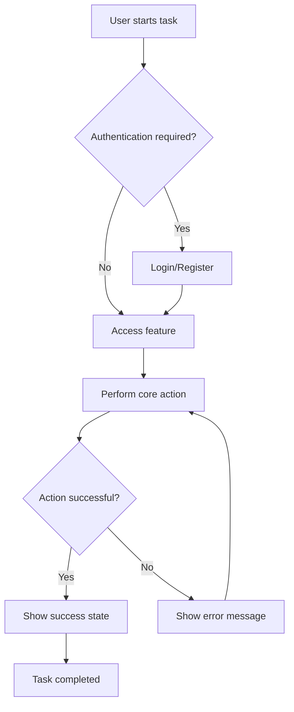
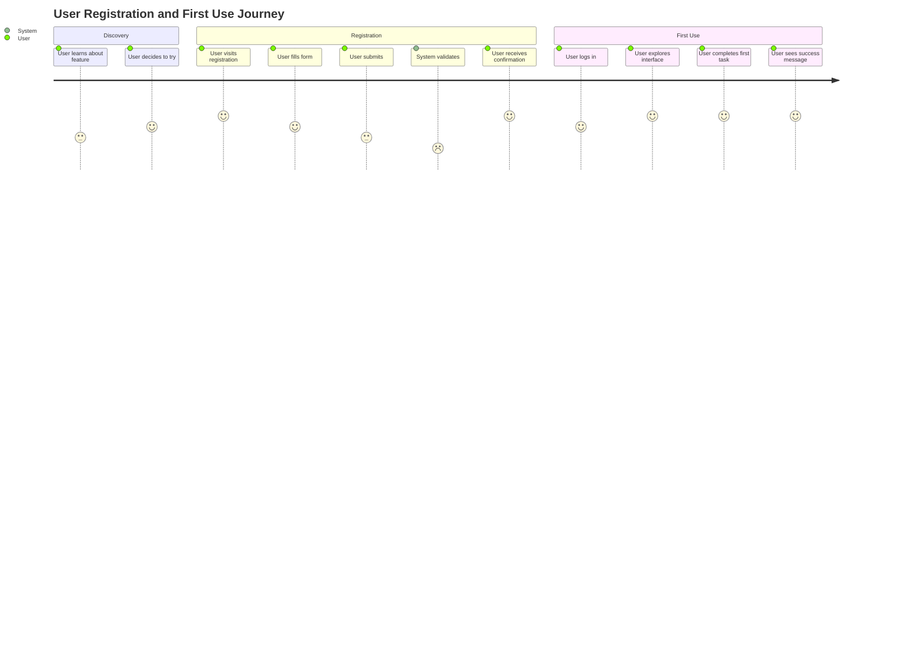

---
description: Workflow for creating comprehensive Product Requirements Documents (PRDs) as part of spec-driven development
applyTo: "**/docs/**/*.md,**/product-requirements/**/*.md,**/prd-*.md"
---### Writing Guidelines

### Diagram Requirements Summary

PRDs must include the following **Mermaid diagrams** where applicable:

1. **User Flow Diagrams**: Show decision trees and user paths through features
2. **User Journey Maps**: Show end-to-end user experience with emotional states
3. **State Diagrams**: For features with complex state management
4. **Sequence Diagrams**: For complex user-system interactions (when helpful for clarity)

**Diagram Placement Guidelines**:
- Place user flow diagrams in Functional Requirements section
- Place user journey maps in Success Metrics section
- Place state diagrams near relevant user stories
- Use consistent Mermaid syntax and styling
- Include descriptive titles and legends where helpful
- Ensure diagrams are readable and not overly complex

### Clarity and Precision Product Requirements Document (PRD) Creation Workflow

## Overview

This workflow guides you through creating comprehensive Product Requirements Documents (PRDs) as part of the **spec-driven development process**. PRDs bridge the gap between Business Requirements Documents (BRDs) and System Requirements Documents (SRDs), focusing on product features and user experiences.

**Position in Spec-Driven Flow**: BRD → **PRDs with User Stories** → System Architecture (with ADRs) → SRDs → Implementation Tasks

## Prerequisites

Before creating PRDs, ensure you have:
- ✅ **Business Requirements Document (BRD)** defining business goals and constraints
- ✅ **Stakeholder alignment** on business objectives
- ✅ **User research insights** and personas (if applicable)

## Process

### Step 1: BRD Analysis and Feature Decomposition

1. **Review the BRD** to understand:
   - Business objectives and success criteria
   - Target market and user personas
   - Key constraints (budget, timeline, regulatory)
   - High-level capabilities required

2. **Decompose business requirements** into product features:
   - Map business goals to user-facing features
   - Identify feature domains (e.g., authentication, data management, reporting)
   - Prioritize features by business value and user impact

3. **Define PRD scope boundaries**:
   - Each PRD should focus on a cohesive feature domain
   - Avoid mixing unrelated functionalities
   - Consider system boundaries for future architecture design

### Step 2: User-Centric Requirements Gathering

When a user provides a feature request or you're decomposing from BRD, gather:

- **Problem/Goal**: What specific user problem does this feature solve?
- **Target User**: Who are the primary and secondary users?
- **User Workflows**: How will users accomplish their goals?
- **User Stories**: What are the key user scenarios and edge cases?
- **Acceptance Criteria**: What defines successful feature completion?
- **Feature Boundaries**: What's included and explicitly excluded from this PRD?
- **Data Requirements**: What data needs to be captured, processed, or displayed?
- **Integration Points**: How does this feature connect to other systems?
- **Business Rules**: What constraints or logic must the feature enforce?
- **Performance Expectations**: What are the speed, scalability, and reliability requirements?

### Step 3: PRD Structure (Standardized Template)

Create a comprehensive PRD with these **required sections**:

#### 1. Executive Summary
- **Feature Name**: Clear, descriptive name
- **Business Context**: Reference to parent BRD and business objectives
- **User Value Proposition**: Primary benefit to end users
- **Success Metrics**: How success will be measured

#### 2. Problem Statement
- **Current State**: What users experience today
- **Desired State**: What users should experience with this feature
- **Business Impact**: Why this problem matters to the organization

#### 3. User Stories with Acceptance Criteria

Use this **standardized format**:

```markdown
## User Story: [Story Title]
**As a** [user type]
**I want** [functionality]
**So that** [business value]

### Acceptance Criteria
- [ ] Criterion 1 (specific, testable condition)
- [ ] Criterion 2 (specific, testable condition)
- [ ] Criterion 3 (specific, testable condition)

### Edge Cases
- [ ] Edge case 1 (boundary condition or error scenario)
- [ ] Edge case 2 (alternative flow or exception)

### Definition of Done
- [ ] Feature implemented and tested
- [ ] User documentation updated
- [ ] Performance requirements met
- [ ] Security review completed (if applicable)
- [ ] Accessibility standards met (if applicable)
```

#### 4. Functional Requirements
- **Core Capabilities**: Primary feature functionality
- **User Interactions**: Step-by-step user workflows
- **Business Logic**: Rules, calculations, and constraints
- **Data Management**: CRUD operations and data validation
- **Integration Requirements**: External system interactions

##### User Flow Diagrams (Required)
Include Mermaid user flow diagrams for key user journeys:



**Guidelines for User Flow Diagrams**:
- Show all major user paths through the feature
- Include decision points and error scenarios
- Use clear, action-oriented labels
- Show both happy path and alternative flows
- Include authentication and authorization checkpoints

#### 5. Non-Functional Requirements
- **Performance**: Response times, throughput, scalability targets
- **Security**: Authentication, authorization, data protection requirements
- **Usability**: Accessibility standards, user experience guidelines
- **Reliability**: Uptime, error handling, recovery procedures
- **Compatibility**: Browser, device, and system compatibility

#### 6. Technical Considerations (Pre-Architecture)
- **Data Storage**: Types of data and approximate volumes
- **External Dependencies**: Third-party services or APIs required
- **Scalability Needs**: Expected user load and growth patterns
- **Security Constraints**: Compliance requirements and sensitive data handling
- **Performance Constraints**: Critical performance requirements

#### 7. Success Metrics and Validation
- **Key Performance Indicators (KPIs)**: Quantifiable success measures
- **User Acceptance Testing**: How feature success will be validated
- **Business Impact Metrics**: How success ties back to business objectives

##### User Journey Mapping (Required)
Include comprehensive user journey diagrams showing end-to-end workflows:



**Guidelines for User Journey Diagrams**:
- Map complete user experience from discovery to task completion
- Include emotional states (satisfaction scores 1-5)
- Show both user actions and system responses
- Identify pain points and optimization opportunities
- Include multiple user personas if applicable

#### 8. Dependencies and Assumptions
- **Prerequisites**: What must exist before this feature can be built
- **Dependencies**: Other features or systems this feature relies on
- **Assumptions**: What we're assuming to be true (risks if assumptions are wrong)

#### 9. Out of Scope (Non-Goals)
- **Explicitly excluded**: Features intentionally not included
- **Future considerations**: Potential enhancements for later phases
- **Boundary clarifications**: Where this feature ends and others begin

#### 10. Open Questions and Risks
- **Unresolved issues**: Items requiring further investigation
- **Technical unknowns**: Areas needing architectural input
- **Business risks**: Potential challenges to feature success

### Step 4: File Management and Naming

- **File naming**: `prd-[feature-domain].md` (e.g., `prd-user-authentication.md`)
- **Directory structure**: 
  - **Monorepo**: `/docs/product-requirements/prd-[feature-domain].md`
  - **Polyrepo**: `[project-name]-specs/product-requirements/prd-[feature-domain].md`
- **Version control**: All PRDs must be under version control
- **Review process**: PRDs require stakeholder approval before moving to architecture phase

## Writing Guidelines

### Clarity and Precision

- **Target audience**: Write for technical stakeholders who will design systems and architecture
- **Explicit requirements**: Be specific and unambiguous about what the feature must do
- **Avoid implementation details**: Focus on WHAT, not HOW (implementation comes in SRDs)
- **Use concrete examples**: Provide specific scenarios and data examples
- **Maintain traceability**: Reference parent BRD and link to system requirements that will follow

### Structure and Format

- **Consistent formatting**: Use standardized markdown headers and bullet points
- **Logical flow**: Order sections from high-level to detailed requirements
- **Cross-references**: Link related user stories and requirements
- **Visual aids**: Include wireframes, user flow diagrams, or mockups when helpful

### Quality Assurance

- **Completeness check**: Ensure all user scenarios are covered
- **Consistency validation**: Verify requirements don't conflict with each other
- **Testability**: Each requirement should be verifiable during testing
- **Stakeholder review**: Have business stakeholders validate user stories and acceptance criteria

## Integration with Spec-Driven Development

### Input Sources
- **Business Requirements Document (BRD)**: Primary source for feature priorities
- **User research**: Personas, user interviews, and usability studies
- **Competitive analysis**: Feature gaps and market requirements
- **Technical constraints**: From preliminary architecture discussions

### Output Artifacts
- **System Architecture Input**: PRDs inform system boundary decisions
- **Architecture Decision Records (ADRs)**: Complex features may require architectural decisions
- **System Requirements Documents (SRDs)**: Technical teams use PRDs to create detailed system specs
- **Implementation Tasks**: Development teams break down user stories into coding tasks

### Validation and Approval

Before proceeding to system architecture:
1. **Business stakeholder approval**: Confirm features align with business goals
2. **User validation**: Validate user stories with actual users (if possible)
3. **Technical feasibility review**: High-level technical assessment from architecture team
4. **Cross-PRD consistency**: Ensure multiple PRDs don't conflict or overlap inappropriately

### Maintenance and Evolution

- **Living documents**: Update PRDs as requirements evolve during development
- **Change tracking**: Document requirement changes and their rationale
- **Impact assessment**: When changing PRDs, assess impact on system architecture and SRDs
- **Version management**: Tag PRD versions that correspond to system releases

## Template Example

```markdown
# PRD: User Authentication System

## Executive Summary
**Feature Name**: User Authentication System
**Business Context**: Supports BRD requirement for secure user access (ref: business-requirements.md, section 3.2)
**User Value Proposition**: Users can securely access the platform with minimal friction
**Success Metrics**: 95% successful login rate, <2 second authentication response time

## Problem Statement
**Current State**: Users cannot access the platform securely
**Desired State**: Users can register, login, logout, and manage their accounts securely
**Business Impact**: Enables user data protection and personalized experiences

## User Story: User Registration
**As a** new user
**I want** to create an account with email and password
**So that** I can access personalized features

### Acceptance Criteria
- [ ] User can register with valid email and strong password
- [ ] System validates email format and password strength
- [ ] User receives email confirmation before account activation
- [ ] System prevents duplicate email registrations

[Continue with remaining sections...]
```

This PRD structure ensures that all necessary information flows effectively from business requirements to system architecture and implementation planning.

- Use consistent markdown formatting
- Include clear headings and subheadings
- Use bullet points for lists
- Include code examples where relevant

### Completeness

- Address all aspects of the feature
- Include error handling scenarios
- Consider edge cases and boundary conditions
- Specify data validation requirements

## Example PRD Template

```markdown
# PRD: [Feature Name]

## Introduction
Brief description of what we're building and why.

## Goals
- Primary goal
- Secondary goals
- Business objectives

## User Stories
- [x] As a [user type], I want [action] so that [benefit]
- [ ] As a [user type], I want [action] so that [benefit]

## Functional Requirements
### Core Features
- Feature 1: Description
- Feature 2: Description

### User Interactions
- Step-by-step user flows
- Input validation requirements
- Error handling

## Non-Goals
- What we're NOT building
- Future considerations

## Design Considerations
- UI/UX requirements
- Accessibility needs
- Mobile responsiveness

## Technical Considerations
- Performance requirements
- Security considerations
- Integration points

## Success Metrics
- How we'll measure success
- Acceptance criteria

## Open Questions
- Unresolved issues
- Items needing clarification
```

## Best Practices

### For GitHub Copilot Users

- Use this PRD as context when starting development
- Reference specific sections when asking Copilot for implementation help
- Keep the PRD updated as requirements evolve
- Use PRD sections as prompts for generating code

### Quality Assurance

- Review PRD with stakeholders before starting development
- Ensure all requirements are testable
- Validate that success metrics are measurable
- Confirm technical feasibility

### Documentation

- Keep PRDs version controlled
- Link to related documents and resources
- Update PRDs as requirements change
- Archive completed PRDs for reference

## Integration with Development Workflow

This PRD creation process integrates with:

- **Task Generation**: Use the completed PRD to generate specific development tasks
- **Task Execution**: Reference PRD sections during implementation
- **Code Review**: Validate implementations against PRD requirements
- **Testing**: Create test cases based on PRD specifications