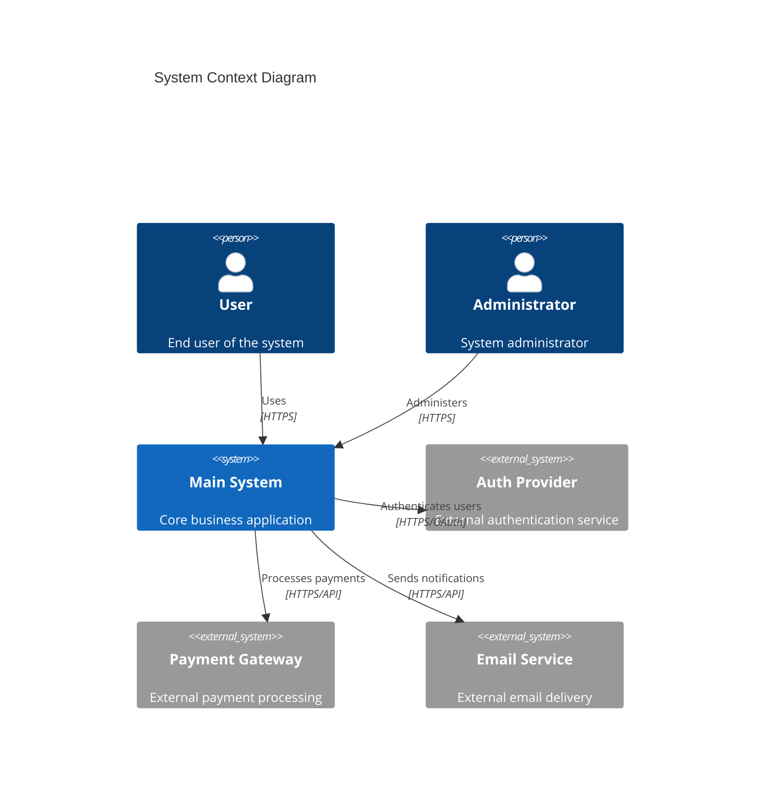
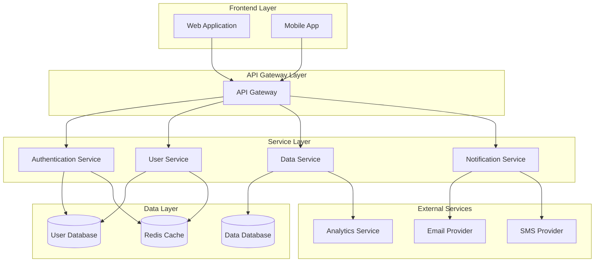
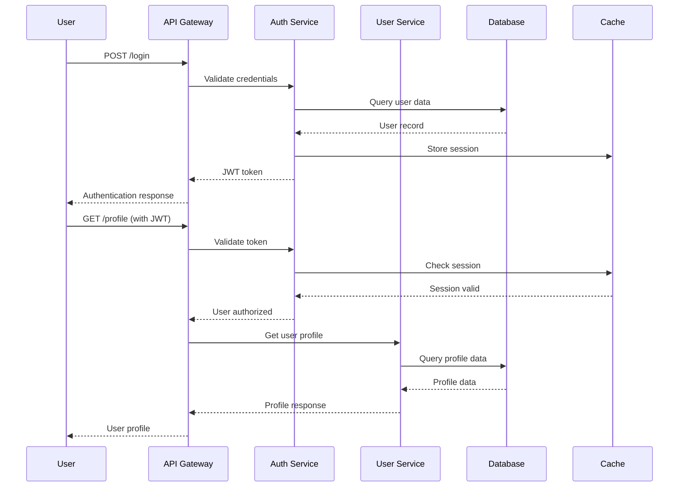
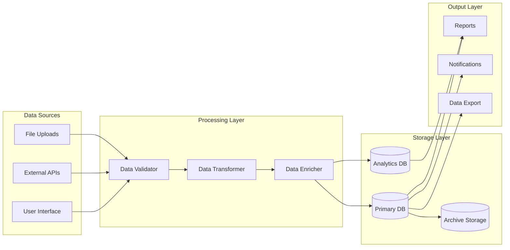
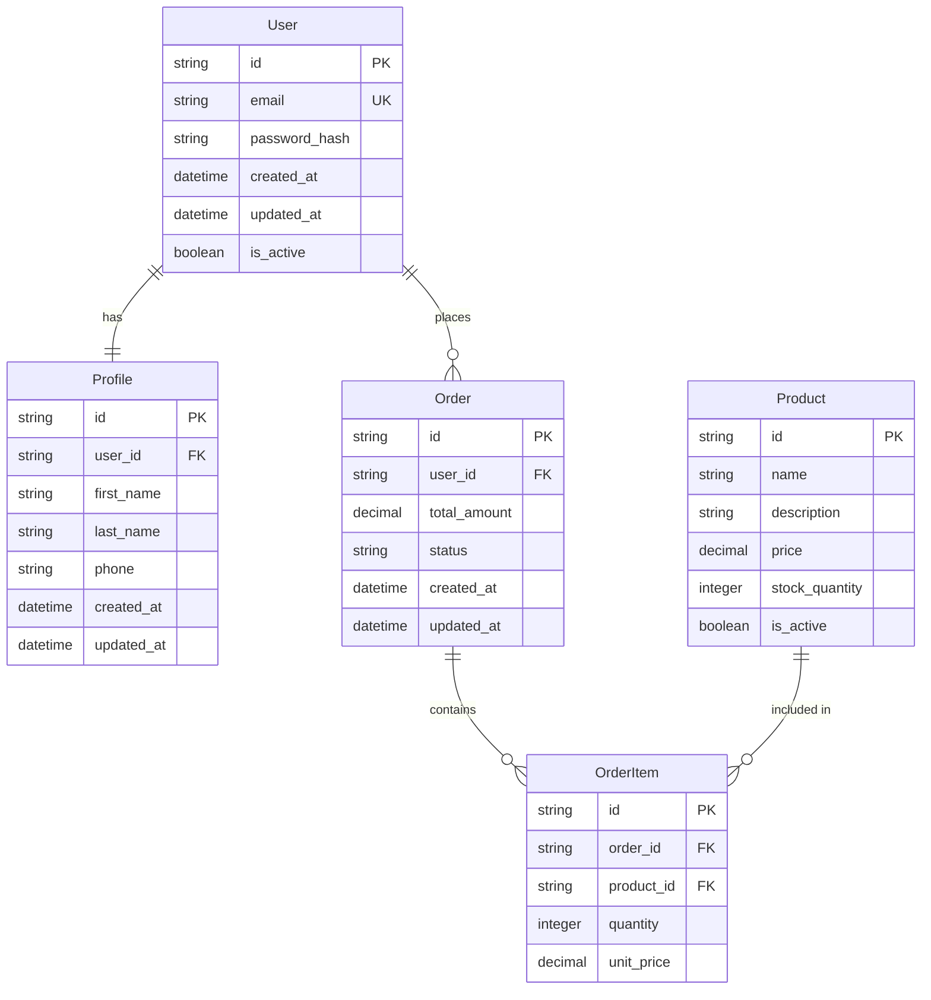
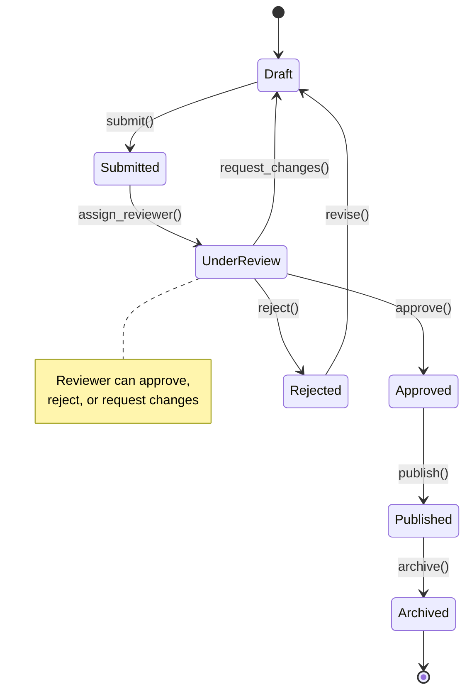
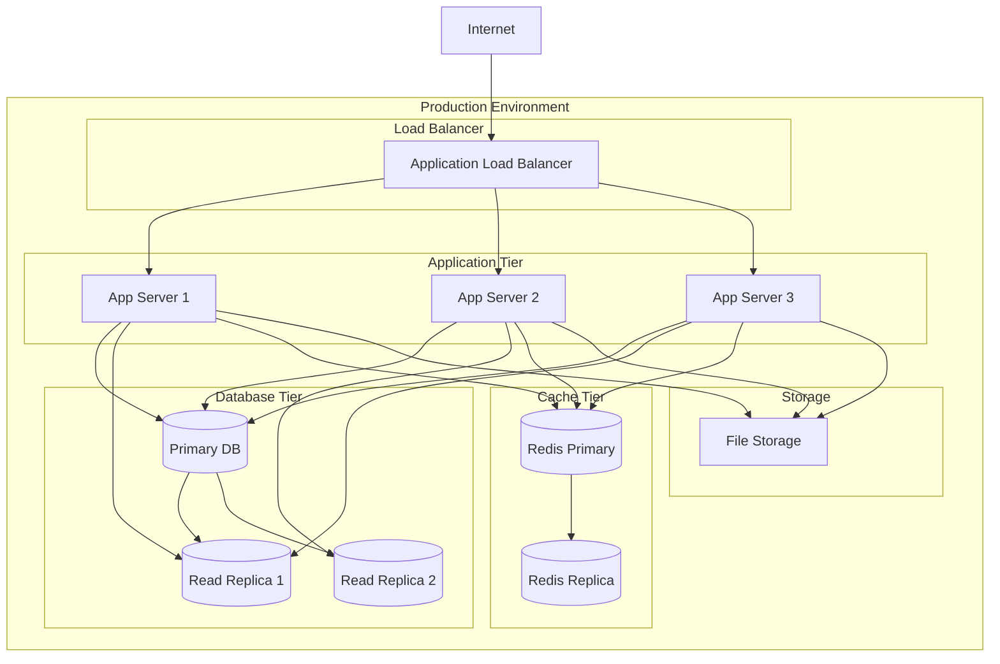

# System Architecture and ADR Creation Workflow

## Overview

System architecture design translates Product Requirements Documents (PRDs) into high-level system design, defining how multiple systems work together to deliver business value. Architecture Decision Records (ADRs) capture significant architectural choices and their rationale.

**Position in Spec-Driven Flow**: BRD → PRDs with User Stories → **System Architecture (with ADRs)** → SRDs → Implementation Tasks

## Prerequisites

Before creating system architecture, ensure you have:
- ✅ **Complete set of approved PRDs** covering all major feature domains
- ✅ **Business Requirements Document (BRD)** with constraints and objectives
- ✅ **Non-functional requirements** from PRDs consolidated
- ✅ **Technology constraints** and existing system inventory
- ✅ **Team structure and delivery timeline** understanding

## Process

### Step 1: Requirements Analysis and System Boundary Identification

1. **Analyze PRDs Collectively**
   - Identify common data entities across PRDs
   - Map user workflows that span multiple feature domains
   - Extract performance, security, and scalability requirements
   - Identify integration points with external systems

2. **Define System Boundaries**
   - Group related functionality into logical systems
   - Identify data ownership and responsibility boundaries
   - Define integration patterns between systems
   - Consider team ownership and development independence

3. **Extract Architectural Drivers**
   - **Quality Attributes**: Performance, security, scalability, availability
   - **Business Constraints**: Budget, timeline, regulatory requirements
   - **Technical Constraints**: Existing systems, technology choices, team skills
   - **Organizational Constraints**: Team structure, development process, deployment model

### Step 2: High-Level Architecture Design

#### System Decomposition
- **Identify Core Systems**: Based on business domain boundaries from PRDs
- **Define System Responsibilities**: What each system owns and manages
- **Map System Interactions**: How systems communicate and share data
- **Design Data Flow**: How information moves through the architecture

#### Integration Pattern Selection
- **Synchronous Communication**: REST APIs, GraphQL, gRPC
- **Asynchronous Communication**: Message queues, event streams, webhooks
- **Data Sharing**: Shared databases, data replication, event sourcing
- **User Interface Integration**: Micro-frontends, shared component libraries

### Step 3: System Architecture Document Structure

Create `system-architecture.md` with these **required sections**:

#### 1. Architecture Overview
- **Vision Statement**: High-level description of the system architecture
- **Architectural Principles**: Guiding principles for all design decisions
- **Context Diagram**: Visual representation of systems and external dependencies
- **Key Quality Attributes**: Primary non-functional requirements driving design

##### System Context Diagram (Required)
Include a high-level context diagram showing the relationship between systems and external entities:



##### High-Level Architecture Diagram (Required)
Include a comprehensive architecture overview showing all systems and their relationships:



#### 2. System Inventory
```markdown
## System: [System Name]
**Purpose**: [Primary responsibility and business capability]
**Data Ownership**: [What data this system owns and manages]
**Key Interfaces**: [Primary APIs or interfaces exposed]
**Technology Stack**: [Chosen technologies and frameworks]
**Team Ownership**: [Which team owns this system]

### Core Responsibilities
- [Responsibility 1: Specific capability]
- [Responsibility 2: Specific capability]
- [Responsibility 3: Specific capability]

### External Dependencies
- [External System 1: What data/services are consumed]
- [External System 2: What data/services are consumed]

### Scaling Characteristics
- **Expected Load**: [User volume, transaction volume]
- **Growth Pattern**: [How load is expected to grow]
- **Scaling Strategy**: [Horizontal/vertical scaling approach]
```

#### 3. Integration Architecture

##### Communication Patterns
```markdown
## Integration: [System A] ↔ [System B]
**Pattern**: Synchronous/Asynchronous/Event-driven
**Protocol**: REST/GraphQL/gRPC/Message Queue
**Data Format**: JSON/Protobuf/Avro
**Authentication**: API Key/OAuth/JWT/mTLS

### Use Cases
- [Use Case 1: When this integration is used]
- [Use Case 2: When this integration is used]

### Error Handling
- [How failures are detected and handled]
- [Retry policies and circuit breaker patterns]
- [Fallback mechanisms]

### Performance Requirements
- **Response Time**: [Target response time]
- **Throughput**: [Expected requests per second]
- **Availability**: [Required uptime percentage]
```

##### System Interaction Diagrams (Required)
Include sequence diagrams for key system interactions:



##### Data Flow Diagrams (Required)
Show how data moves through the system:



##### Data Architecture
- **Data Ownership**: Which system owns which data entities
- **Data Consistency**: How consistency is maintained across systems
- **Data Synchronization**: How data updates are propagated
- **Master Data Management**: How shared reference data is managed

##### Entity Relationship Diagrams (Required)
Include ER diagrams showing key data relationships across systems:



##### System State Diagrams (Where Applicable)
For systems with complex state management, include state diagrams:



#### 4. Technology Stack

##### Technology Selection Matrix
```markdown
| Component | Technology Choice | Rationale | Alternatives Considered |
|-----------|------------------|-----------|------------------------|
| Backend Language | [Language] | [Why chosen] | [What else was considered] |
| Database | [Database] | [Why chosen] | [What else was considered] |
| Message Queue | [Technology] | [Why chosen] | [What else was considered] |
| Frontend Framework | [Framework] | [Why chosen] | [What else was considered] |
| API Gateway | [Technology] | [Why chosen] | [What else was considered] |
```

##### Infrastructure Architecture
- **Deployment Model**: Cloud/On-premise/Hybrid
- **Container Strategy**: Docker, Kubernetes, serverless
- **Database Strategy**: SQL/NoSQL choices and rationale
- **Caching Strategy**: Redis, CDN, application-level caching
- **Monitoring and Observability**: Logging, metrics, tracing tools

#### 5. Security Architecture

##### Security Patterns
- **Authentication**: How users and services authenticate
- **Authorization**: How access control is implemented
- **Data Protection**: Encryption at rest and in transit
- **Network Security**: Firewalls, VPNs, network segmentation
- **Secrets Management**: How sensitive configuration is handled

##### Compliance Requirements
- **Regulatory Requirements**: GDPR, HIPAA, SOC2, etc.
- **Data Residency**: Where data can be stored and processed
- **Audit Requirements**: What events must be logged and retained
- **Security Controls**: Required security measures and validations

#### 6. Deployment and Operations

##### Environment Strategy
- **Development Environment**: Local development setup
- **Testing Environments**: Integration, staging, performance testing
- **Production Environment**: Production deployment and scaling
- **Disaster Recovery**: Backup and recovery procedures

##### Deployment Architecture (Required)
Include deployment diagrams showing infrastructure and environment organization:



##### DevOps and CI/CD
- **Build Pipeline**: How code is built and tested
- **Deployment Pipeline**: How code is deployed to environments
- **Configuration Management**: How environment-specific config is managed
- **Monitoring and Alerting**: How system health is monitored

##### CI/CD Pipeline Diagram (Required)
Show the complete build and deployment pipeline:

```mermaid
flowchart LR
    subgraph "Development"
        Dev[Developer]
        Git[Git Repository]
    end
    
    subgraph "CI Pipeline"
        Trigger[Webhook Trigger]
        Build[Build & Test]
        Security[Security Scan]
        Package[Package Artifacts]
    end
    
    subgraph "CD Pipeline"
        Deploy_Dev[Deploy to Dev]
        Test_Int[Integration Tests]
        Deploy_Stage[Deploy to Staging]
        Test_E2E[E2E Tests]
        Approve[Manual Approval]
        Deploy_Prod[Deploy to Production]
    end
    
    subgraph "Monitoring"
        Health[Health Checks]
        Metrics[Metrics Collection]
        Alerts[Alerting]
    end
    
    Dev --> Git
    Git --> Trigger
    Trigger --> Build
    Build --> Security
    Security --> Package
    Package --> Deploy_Dev
    Deploy_Dev --> Test_Int
    Test_Int --> Deploy_Stage
    Deploy_Stage --> Test_E2E
    Test_E2E --> Approve
    Approve --> Deploy_Prod
    Deploy_Prod --> Health
    Health --> Metrics
    Metrics --> Alerts
```



### Diagram Requirements Summary

System Architecture documents must include the following **Mermaid diagrams**:

1. **System Context Diagram**: High-level view of system relationships and external entities
2. **High-Level Architecture Diagram**: Complete system overview with all major components
3. **System Interaction Diagrams**: Sequence diagrams for key workflows
4. **Data Flow Diagrams**: How data moves through the system
5. **Entity Relationship Diagrams**: Key data relationships across systems
6. **System State Diagrams**: For systems with complex state management
7. **Deployment Architecture Diagram**: Infrastructure and environment layout
8. **CI/CD Pipeline Diagram**: Build and deployment workflow

**Diagram Standards**:
- Use consistent naming conventions across all diagrams
- Include clear titles and legends
- Use appropriate Mermaid diagram types for different purposes
- Ensure diagrams are readable and not overly complex
- Update diagrams when architecture changes
- Place diagrams in relevant sections for context

### Step 4: Architecture Decision Records (ADRs)

For each significant architectural decision, create an ADR using this template:

#### ADR Template: `adr-[system]-[decision-topic].md`

```markdown
# ADR: [System] - [Decision Title]

**Status**: Proposed/Accepted/Superseded
**Date**: [YYYY-MM-DD]
**Decision Makers**: [Who made this decision]
**Consulted**: [Who was consulted]
**Informed**: [Who was informed]

## Context and Problem Statement

[Describe the architectural decision to be made, including:]
- [What is the issue we're trying to solve?]
- [What are the driving forces behind this decision?]
- [What constraints or requirements are influencing this choice?]

## Decision Drivers

- [Driver 1: e.g., performance requirements]
- [Driver 2: e.g., team expertise]
- [Driver 3: e.g., integration constraints]
- [Driver 4: e.g., budget limitations]

## Considered Options

### Option 1: [Option Name]
**Description**: [Brief description of this option]

**Pros**:
- [Advantage 1]
- [Advantage 2]

**Cons**:
- [Disadvantage 1]
- [Disadvantage 2]

**Cost/Effort**: [Implementation cost and effort]

### Option 2: [Option Name]
[Same structure as Option 1]

### Option 3: [Option Name]
[Same structure as Option 1]

## Decision Outcome

**Chosen Option**: [Selected option name]

**Rationale**: [Explain why this option was chosen over the alternatives]

### Consequences

**Positive**:
- [Positive consequence 1]
- [Positive consequence 2]

**Negative**:
- [Negative consequence 1 and mitigation strategy]
- [Negative consequence 2 and mitigation strategy]

**Neutral**:
- [Neutral consequence 1]

## Implementation Notes

- [Implementation consideration 1]
- [Implementation consideration 2]
- [Timeline and milestones]

## Related Decisions

- [Link to related ADR 1]
- [Link to related ADR 2]

## Review Schedule

**Next Review**: [Date when this decision should be revisited]
**Review Criteria**: [What changes would trigger a review of this decision]
```

#### Common ADR Categories

1. **Technology Choices**
   - Programming languages and frameworks
   - Database technologies
   - Infrastructure and deployment platforms
   - Third-party service selections

2. **Architectural Patterns**
   - Microservices vs. monolith decisions
   - Communication patterns (sync vs. async)
   - Data consistency approaches
   - Security patterns and implementations

3. **Integration Decisions**
   - API design approaches (REST vs. GraphQL vs. gRPC)
   - Message queue and event streaming choices
   - Data sharing and synchronization strategies
   - External service integration patterns

### Step 5: Validation and Review Process

#### Architecture Review
1. **Technical Review**
   - Validate against non-functional requirements from PRDs
   - Ensure chosen technologies can meet performance requirements
   - Review integration complexity and failure modes
   - Assess scalability and operational characteristics

2. **Business Alignment Review**
   - Confirm architecture supports all PRD user stories
   - Validate that system boundaries align with business domains
   - Ensure integration patterns support business workflows
   - Review cost and timeline implications

3. **Risk Assessment**
   - Identify technical risks and mitigation strategies
   - Assess team capability gaps and training needs
   - Review dependency risks and alternatives
   - Evaluate operational complexity and support requirements

#### Stakeholder Approval
- **Technical stakeholders**: Architecture team, senior engineers
- **Business stakeholders**: Product owners, business sponsors
- **Operations stakeholders**: DevOps, security, compliance teams
- **Development stakeholders**: Engineering managers, tech leads

### Step 6: File Management and Maintenance

#### File Organization
**Monorepo Structure**:
```
docs/
├── system-architecture.md
└── architecture-decisions/
    ├── adr-auth-service-token-strategy.md
    ├── adr-data-service-database-choice.md
    └── adr-api-gateway-selection.md
```

**Polyrepo Structure**:
```
[project-name]-specs/
├── system-architecture.md
└── architecture-decisions/
    ├── adr-auth-service-token-strategy.md
    ├── adr-data-service-database-choice.md
    └── adr-api-gateway-selection.md
```

#### Version Control and Change Management
- All architecture documents under version control
- Link architecture versions to PRD versions
- Establish change approval process for architectural modifications
- Maintain ADR status (proposed → accepted → superseded)

## Quality Assurance

### Architecture Validation Checklist

- [ ] **Completeness**: All PRD requirements addressed by architecture
- [ ] **Consistency**: ADRs align with overall architectural principles
- [ ] **Feasibility**: Chosen technologies can meet requirements
- [ ] **Scalability**: Architecture can handle expected growth
- [ ] **Maintainability**: System boundaries enable independent development
- [ ] **Testability**: Architecture supports comprehensive testing strategies

### Common Architecture Anti-Patterns to Avoid

- **Distributed Monolith**: Systems too tightly coupled despite being separate
- **Chatty Interfaces**: Too many fine-grained service calls
- **Shared Database**: Multiple systems directly accessing same database
- **Technology Sprawl**: Too many different technologies without justification
- **Single Point of Failure**: Critical systems without redundancy

## Output to Next Phase

The completed system architecture and ADRs enable creation of:
- **System Requirements Documents (SRDs)**: Detailed requirements for each system
- **Implementation Planning**: Task breakdown and development sequencing
- **Team Formation**: System ownership and development responsibilities
- **Infrastructure Planning**: Environment setup and deployment strategies

This systematic approach ensures that the overall architecture is well-thought-out, documented, and ready to guide detailed system design and implementation.
